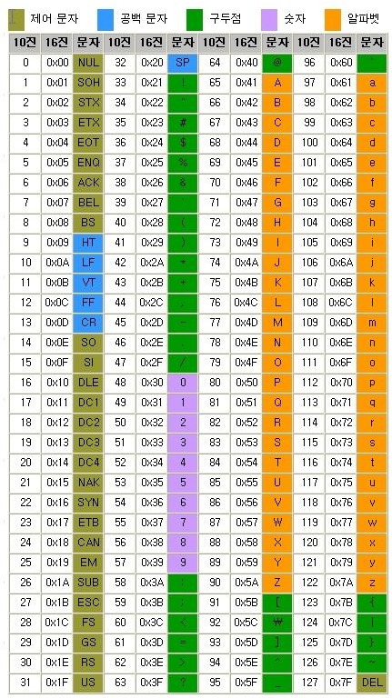
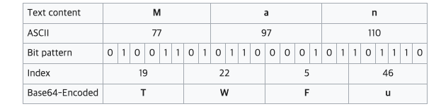
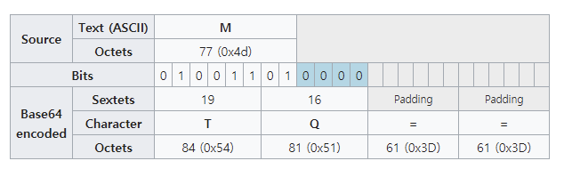
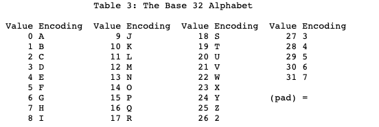
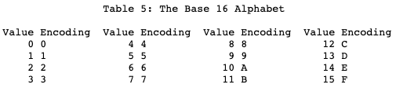

웹개발을 하다보면 base64 같은 인코딩 방식들을 접하게 된다. 최근까지도 그냥 바이너리를 인코딩 하는 표준이겠지 정도만 생각해보았는데, 알아보니 흥미롭다. 인코딩이란 무엇이며 어떤 방식의 인코딩을 base-N으로 부르는지, 또 base64 외에도비슷한 base62, base32, base16 같은 다른 표준들이 서로 어떤 차이가 있는지 등을 살펴본다.

## 인코딩(encoding)이란

- 사람이 쓰는 문자, 그림 등의 데이터를 → 컴퓨터가 이용할 수 있는 신호(0, 1)로 만드는 것
    - 010101010... 을 무엇으로 매핑할것인가
- 다양한 문자 인코딩 방식들
    - 아스키코드(ASCII)
        - American Standard Code for Information Interchange
        - 초기 컴퓨터의 텍스트 표현 표준 (1963~)
        
        
        
    - 유니코드
- 더 자세한 문자 인코딩에 대해서는 [위키](https://en.wikipedia.org/wiki/Character_encoding) 참조

## Binary-to-text encoding이란

- 인쇄 가능한(printable) 문자열로 이진 데이터를 인코딩하는 것.
- 대표적으로 사용되는 곳이 이메일인데, 이메일의 프로토콜(SMTP)은 텍스트 기반으로 데이터를 주고받는다. 이 때 7비트 ASCII 로 전송하게 되어있는데, 대부분의 컴퓨터는 8비트(바이트)로 된 메모리에 데이터를 저장한다. 8비트 이상의 영어 아닌 언어, 그림,음악,영화 등을 데이터 손실 없이 전송하기 위해 이러한 인코딩이 필요하다.

binary-to-text encoding 중 가장 많이 쓰이는 base64부터 62, 32, 16까지 살펴보자.

## Base64

- base-N은 'N진법'을 뜻한다. 따라서 '64진법' 이라는 뜻. 8bit binary 데이터를 문자 코드에 영향을 받지 않는 공통 ASCII영역의 문자들로만 이루어진 문자열로 바꾸는 인코딩 방식이다. (by [wiki](https://ko.wikipedia.org/wiki/%EB%B2%A0%EC%9D%B4%EC%8A%A464))
    - 세계 곳곳의 문자들을 담아내야하는 니즈가 생기면서 ISO-8859, 유니코드 등 다양한 문자 인코딩 방식들이 생겼다. 근데 각각 커버할 수 있는 문자들이 다르고.. 결국 문자 코드와 상관없이 표현하려면 ASCII로 변환되어야 한다.
    - 8비트 3개 → 6비트 4개로 쪼개어 표현한다. (2^6 = 64)
    
    
    
    - A-Z,a-z,0-9 (총 62개) 와 "+", "/" 기호 =  64개로 구성된다. (끝을 알리는 "="도 있음)
        - 10진법 "1234567890"
        - 16진법 "1234567890abcdef"
        - 64진법 "ABCDEFGHIJKLMNOPQRSTUVWXYZabcdefghijklmnopqrstuvwxyz0123456789+/"
        - → 화면에 표시되는 ASCII문자(제어문자는 포함x)들을 써서 표현할 수 있는 가장 큰 진법이 64. 표시되는 ASCII문자들은 128개가 안된다.
    - url : url의 스펙 상 사용할 수 없는 문자들이 있다.
        - ([rfc 3986](https://datatracker.ietf.org/doc/html/rfc3986) 참고 : "+", "/" 는 reserved character(예약문자)로 쓰인다)
        - → 이때는 "Url and Filename safe"Base64 또는 base62를 사용해야 한다.

### 데이터를 base64로 바꾸는 과정

- 변환할 때 위 그림처럼 딱 들어맞는 24비트만 있지 않다. 그럴땐 padding을 이용한다.

- 0으로 남는자리를 채우고, 아얘 bit가 없는 부분은 padding문자 "="가 된다.
- → 인코딩 결과 원본보다 4/3 정도 크기가 늘어나게 된다.

## Base 62

- (2^n 이 아니어서 이상해보이지만)  base64에서 특수문자를 빼고 A-Z,a-z,0-9 로만 구성되는 방식이다.
- 상황에 따라 특수문자를 치환해서 써야하는 이슈(대표적으로 url)에 대응할 수 있다.

## Base 32

- 32진수 표현방식. 5비트씩으로 나타내는 문자 셋 표현
- base64 대비 장점
    - 대소문자 구분하지 않는 파일시스템, DNS이름, 음성언어 등에서 사용될 때 유용하다
    - unix경로구분 기호('/') 를 포함할 수 없어서 파일 이름으로 사용할 수 있다
    - 사람이 읽을 때 유사하게 보이는 기호쌍을 피한다(I, B, O랑 헷갈리는 1, 8, 0을 생략)
- base64 대비 단점
    - 20% 더 많은 공간을 차지한다

## Base16(hex)

- 16진수 표현방식.
    - 8비트 octet(1바이트)을 2개의 4비트 문자 (2바이트)로 바꾼다
- 장점
    - 대부분의 프로그래밍 언어에는 이미 ASCII로 인코딩된 16진수를 구문 분석하는 기능이 있다
    - 32, 64와 달리 padding이 필요없다 (8비트(1byte)의 절반이므로)
    - 16진수는 자주 쓰이므로 mapping 테이블 없이도 한눈에 쉽게 이해된다
- 단점
    - 공간 효율성이 50%로 떨어진다.

---

### References

- [https://datatracker.ietf.org/doc/html/rfc4648](https://datatracker.ietf.org/doc/html/rfc4648) ⭐
- [https://en.wikipedia.org/wiki/Base64](https://en.wikipedia.org/wiki/Base64)
- [https://hyoje420.tistory.com/1](https://hyoje420.tistory.com/1)
- [https://dokhakdubini.tistory.com/505](https://dokhakdubini.tistory.com/505)

### FYI.

- octet: 8개의 비트의 모음. 보통은 1byte를 의미 (초기 컴퓨터들은 1 바이트가 꼭 8비트만을 의미하지 않았으므로, 8비트를 명확하게 정의하기 위해 옥텟이라는 용어가 필요했다고 함)
- percent-encoding: rfc3986에 따라 uri에 문자를 표현하는 인코딩 방식