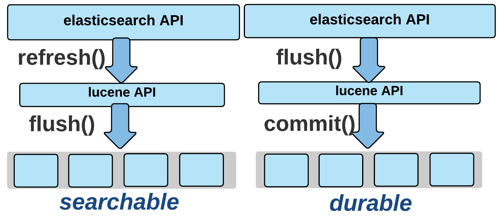

elasticsearch indexing할때 성능을 향상시키는 방법을 찾아보면 refresh inverval 설정을 -1로 해두는 방법이 나온다. 그래서 개발 초기에 template 설정할 때 우선 -1로 설정해두었었는데, 데이터를 확인하려다보니 아무리 docs를 넣어도 검색했을 때 보이지 않는 이슈가 생겼다. refresh interval을 -1로 설정한다는 건 refresh를 하지 않도록 설정하는 것이었기 때문이었다. (문서를 제대로 읽었어야했다ㅠ [indexing 성능 향상에 대한 elastic의 가이드]([https://www.elastic.co/guide/en/elasticsearch/reference/current/tune-for-indexing-speed.html](https://www.elastic.co/guide/en/elasticsearch/reference/current/tune-for-indexing-speed.html)) ) 내부적으로 어떻게 저장하고 있길래 refresh라는 개념이 있고, 왜 검색이 되지 않았었는지 전반적으로 elasticsearch의 구조와 함께 좀더 찾아봤다.

## 기본적인 구조

elasticsearch 어플리케이션은 노드 여러개를 하나의 클러스터로 묶어서 구성할 수 있다. 물리서버 하나 당 하나의 노드를 실행하는게 권장된다고 한다. 

index 하나는 여러 개의 샤드에 나눠서 저장이 되는데, 이 샤드들은 각각 다른 노드에 분산 저장된다. replica를 1개 이상 지정하면 서로 다른 노드에 레플리카가 위치하게 된다.

 (https://esbook.kimjmin.net/03-cluster/3.2-index-and-shards)

## document를 수정/삭제/추가 할때 어떻게 되나?

elasticsearch는 lucene기반의 검색엔진 이므로 lucene의 구조를 찾아보면서 좀더 이해해갔다.

### 수정

Lucene에서 index 파일들은 **immutable(불변)** 이다. = 수정이 불가능하다. 예전에 수정이 불가능하다는 말만 기억하고 있었는데, elasticsearch 문서를 보면 Update API가 있어서 혼란스러웠다. Update API를 실행하면 내부적으로는 문서를 삭제한 후 다시 삽입하게 되는거였다.ㅎㅎ  문서 수정은 문서 추가보다 비용이 많이 들기 때문에 수정이 잦은 문서를 lucene 인덱스에 저장하는 건 좋은 선택이 아니다.

### 삭제

Lucene에서 어떤 document를 삭제하면 내부적으로 처음에는 실제 삭제가 아닌 bitmap에 이 문서에 대해 삭제되었다는 mark만 하게 된다. 

lucene index는 더 작은 단위인 segment로 구성된다. 

검색할때 lucene은 모든 세그먼트에서 검색하고, 삭제된 문서(삭제라고 mark된 문서)를 필터링하고, 모든 세그먼트로부터 결과를 합쳐서 최종 결과를 내보낸다. 세그먼트 수가 많을수록 느려지므로, lucene은 정책에 따라 세그먼트 수를 유지하기 위해 세그먼트를 병합(merge)하기도 한다. 이렇게 세그먼트를 병합할 때 실제 삭제가 이루어진다.

### 추가

새 문서가 추가되면 index의 변경사항이 처음에는 메모리에 buffer된다. 그 다음에 버퍼의 데이터가 일정량 이상이 되면 disk로 index 파일 전체가 **flush**된다. flush가 되어야 검색에 사용할 수 있게 된다. 실시간 검색에 가깝게 하기 위해서 default로 1초에 한번씩 flush가 된다.  lucene에서 말하는 flush가 elasticsearch의 API로는 refresh다. (elasticsearch의 flush는 lucene의 commit을 호출한다.. 왜이렇게 헷갈리게 해놓은걸까) 

처음에 얘기했던,  refresh_interval 설정을 -1로 했을 때 검색이 안되었던 이유는 새로 인덱싱 된 문서가 인메모리 버퍼에 있고 디스크에 반영되지 않아 찾을 수 없는 거였다.

(https://www.elastic.co/kr/blog/nuxeo-search-and-lucene-oh-my)

## refresh_interval 설정 어떻게 해야할까

우리 프로젝트에서는 인덱스를 하루에 한번 업데이트를 할때 index에 대한 alias를 사용했다. index1에 alias를 붙여서 쓰다가 spring batch로 새로운 index2에 인덱싱을 하고, job이 끝나면 alias index에서 index1를 지우고 index2를 추가하는 식이었다. (블루그린 배포랑 유사하다)

이렇게 하면 index2에 대해 인덱싱을 할 동안 refresh_interval은 -1로 둬도 괜찮다. 검색은 index1로 하고 있기 때문이다. (끝나면 다시 1초나 적당한 시간으로 돌려놔야함) 

그런데 이런 일괄처리 방법을 쓰지 않고 검색에 사용되고 있는 인덱스에 대해 update api로 업데이트가 일어나도록 한다면(그리고 업데이트가 계속 실시간 반영이 되어야한다면) refresh_interval은 디폴트 값으로 두는게 맞다. 

## 마치며

lucene에 대해 더 깊게 찾아보고 글을 쓰고싶었는데, 생각보다 이해가 쉽지 않았다. 개괄적인 정리가 되었으니 다음번에 여기서 한단계 더 들어가보려고 한다.

### 참고

[https://www.elastic.co/kr/blog/found-elasticsearch-from-the-bottom-up](https://www.elastic.co/kr/blog/found-elasticsearch-from-the-bottom-up) ⭐

[https://alibaba-cloud.medium.com/analysis-of-lucene-basic-concepts-5ff5d8b90a53](https://alibaba-cloud.medium.com/analysis-of-lucene-basic-concepts-5ff5d8b90a53) 

[https://esbook.kimjmin.net/03-cluster](https://esbook.kimjmin.net/03-cluster) 

[https://doubly12f.tistory.com/96](https://doubly12f.tistory.com/96) 

[https://ridicorp.com/story/index-aliases/](https://ridicorp.com/story/index-aliases/)