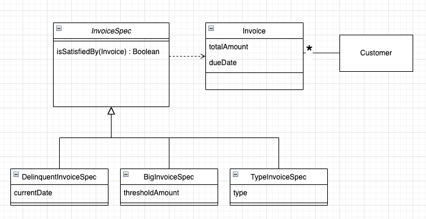

specification pattern은 팀에서 스터디도 하고 여러 프로젝트에 쏠쏠하게 써먹으며 변하기 쉬운 정책/규칙들에 대해 대응하는데 활용하고 있다. 이번 글에서는 specification이 어떤 패턴인지, 적용하기 전과 후에 어떻게 달라질 수 있는지 소개해보려고 한다.

specification pattern은 객체지향 프로그래밍에서 도메인에 대한 특정한 규칙들을 간결하게 표현할 수 있도록 해준다. **도메인 내부에 구현하는 조건 로직**들로부터 **규칙**을 분리해서 규칙이 명시적으로 드러나게 한다. 조건이 단순하다면 굳이 분리할 필요가 없겠지만, 비즈니스 요구사항들이 추가되다보면 entity나 value object 본연의 목적 그 이상으로 규칙이 다양하고 여러모양으로 조합될 수 있다. 이때 **entity나 value object가 특정 기준을 만족하는지 판단하는 술어(predicate)로 분리된 specification을 만든다.** 

```java
interface Specification {
	boolean isSatisfiedBy(Object anObject);
}
```

규칙을 표현하기 위해서 여러 Specification을 구현하고, 논리적으로 술어를 and, or, not 등의 연산자로 결합해서 객체가 어떤 기준을 만족하는지를 나타낼 수 있다. 

술어를 결합한다는 것은- 공연 입장 가능 정책을 예로 들어보면

```java
// 입장가능한가 = (티켓이 있는가) and not(공연시작시간이_지났는가)
boolean isEntryAllowed = hasTicket(customer).and(not(hasPerformanceStarted()));
```

→ `isEntryAllowed`처럼 상세 조건 각각을 Specification 인터페이스를 구현하는 구체적 Specification으로 만들어서 결합하여 나타내는 것이다.

주절주절 설명만으로 크게 와닿지 않을 것 같다. 특정한 상황에서 specification이 어떻게 유용해지는지 예시를 들어보려 한다. (도메인주도설계 책 예시를 가져와 살을 덧붙였다.)

송장(invoice)를 발행하는 결제 도메인에서 고객의 체납 관련 정보를 확인해서 이메일을 전송한다고 가정해보자. 메일을 전송할지에 대한 판단 조건은 두가지, 1) 오늘 날짜가 invoice의 기한 + 유예기간을 합친 기한을 넘겼을 때 2) 미납 금액이 $100을 넘겼을 때 이다.

### specification 적용 전

specification 패턴을 쓰지 않고 도메인 객체 내부에서 조건을 판단하는 메서드를 만들 때 아래와 같이 코드를 짤 수 있다. 

```java
class Invoice {
    private LocalDate dueDate;
    private Customer customer;
    private Money totalAmount;

    boolean isThresholdReached(Money thresholdAmount) {
        return totalAmount.greaterThanOrEqual(thresholdAmount);
    }

    boolean isOverdue(LocalDate currentDate) {
        int gracePeriod = customer.getPaymentGracePeriod();
        LocalDate firmDeadline = dueDate.plusDays(gracePeriod);
        return currentDate.isAfter(firmDeadline);
    }

}
```

도메인 로직을 사용하는 메일 전송쪽 클라이언트 코드는 판단 조건에 대해 조건문으로 쓰게 된다.

```java
if (invoice.isOverdue(LocalDate.now()) && invoice.isThresholdReached(Money.of(100))) {
  send(invoice);
}
```

여기까지는 뭐 크게 나쁘지 않아보인다. 그런데 운영배포를 하고나서 새로운 요구사항이 추가된다면? Z타입의 Invoice는 이메일 전송을 하지 않아야한다고 한다.

Invoice에 메서드를 추가하고, 판단조건을 추가한다. ~~가독성을 위해 개행을 해보았다.~~

```java
if (invoice.isOverdue(LocalDate.now()) && 
		invoice.isThresholdReached(Money.of(100)) &&
		invoice.isNotZType()
		) {
  send(invoice);
}
```

며칠 뒤 또 다른 요구사항이 들어온다. 체납된 사용자 중 체납 금액이 $4000를 초과한 고객에게는 다른 템플릿의 이메일을 전송해야한다고 한다.

```java
if (invoice.isOverdue(LocalDate.now()) &&
        invoice.isThresholdReached(Money.of(100)) &&
        invoice.isNotZType()
) {
    send(invoice, TEMPLATE_NORMAL);
} else if (invoice.isOverdue(LocalDate.now()) &&
        invoice.isThresholdReached(Money.of(4000)) &&
        invoice.isNotZType()
) {
    send(invoice, TEMPLATE_OVER_4000);
}
```

요구사항 두번 추가에 벌써 코드 가독성이 훅 떨어졌다. 다른 요구사항들이 많아지고 조건이 늘어날수록 기존 코드의 로직들을 따라 읽어가며 어디에 끼워넣어야할지 생각해야한다. Invoice 객체의 메서드들은 Invoice 객체 본연의 책임보다 규칙을 판단하기 위한 조건에 대한 메서드가 더 많아질 것이다. 

### specification 적용

specification을 쓰면 어떻게 달라질까? 

처음의 요구사항( 1) 오늘 날짜가 invoice의 기한 + 유예기간을 합친 기한을 넘겼을 때 2) 미납 금액이 $100을 넘겼을 때 )에 대해 각각 Specification 구현체를 생성한다. 

```java
// (Specification 네이밍이 너무 길어서 Spec으로 줄였다)

interface InvoiceSpec {
	boolean isSatisfiedBy(Invoice candidate);
}

class DelinquentInvoiceSpec implements InvoiceSpec {
    private LocalDate currentDate;

    public DelinquentInvoiceSpec(LocalDate currentDate) {
        this.currentDate = currentDate;
    }

    @Override
    public boolean isSatisfiedBy(Invoice candidate) {
        int gracePeriod = candidate.customer().getPaymentGracePeriod();
        LocalDate firmDeadline = candidate.dueDate().plusDays(gracePeriod);
        return currentDate.isAfter(firmDeadline);
    }
}

class BigInvoiceSpec implements InvoiceSpec {
    private Money thresholdAmount;

    public BigInvoiceSpec(Money thresholdAmount) {
        this.thresholdAmount = thresholdAmount;
    }

    @Override
    public boolean isSatisfiedBy(Invoice candidate) {
        return candidate.getTotalAmount().greaterThanOrEqual(thresholdAmount);
    }
}
```

그리고 and로 두 조건을 결합하기 위해서 And에 대한 Specification구현체를 생성한다.

```java
public static class AndSpec implements InvoiceSpec {
    private final InvoiceSpec spec1;
    private final InvoiceSpec spec2;

    public AndSpec(InvoiceSpec spec1, InvoiceSpec spec2) {
        this.spec1 = spec1;
        this.spec2 = spec2;
    }

    @Override
    public boolean isSatisfiedBy(Invoice candidate) {
        return spec1.isSatisfiedBy(candidate) && spec2.isSatisfiedBy(candidate);
    }

    public static InvoiceSpec and(InvoiceSpec left, InvoiceSpec right) {
        return new AndSpec(left, right);
    }
}
```

이메일 전송을 하는 클라이언트 코드는 아래와 같이 표현된다.

```java
static final InvoiceSpec DELINQUENT_SPEC = new DelinquentInvoiceSpec(LocalDate.now());
static final InvoiceSpec BIG_INVOICE_SPEC = new BigInvoiceSpec(Money.of(100));
static final InvoiceSpec EMAIL_SEND_SPEC = and(DELINQUENT_SPEC, BIG_INVOICE_SPEC);

private void send(Invoice invoice) {
	if (EMAIL_SEND_SPEC.isSatisfiedBy(invoice)) {
	  send(invoice);
	}
}
```

and를 중위연산자처럼 나타내면 좀더 사람 언어의 문장처럼 표현할 수 있는데, 인터페이스에 default메서드를 구현하면 가능하다. 

```java
public interface InvoiceSpec {
    boolean isSatisfiedBy(Invoice candidate);

    default InvoiceSpec and(InvoiceSpec right) {
        return new Specs.AndSpec(this, right);
    }
}

InvoiceSpec EMAIL_SEND_SPEC = DELINQUENT_SPEC.and(BIG_INVOICE_SPEC);
```

여기서 요구사항들을 더 추가했을 때의 코드는 이렇게 작성할 수 있다. ~~변수명은 대충 넘어가주시기를~~
* Z타입의 invoice는 이메일 전송을 하지 않아야한다
* 체납된 사용자 중 체납 금액이 $4000를 초과한 고객에게는 다른 템플릿의 이메일을 전송해야한다

```java
static final InvoiceSpec DELINQUENT_SPEC = new DelinquentInvoiceSpec(LocalDate.now());
static final InvoiceSpec Z_TYPE_SPEC = new TypeSpec("Z");
static final InvoiceSpec BIG_INVOICE_SPEC = new BigInvoiceSpec(Money.of(100));
static final InvoiceSpec BIG_INVOICE_SPEC_4000 = new BigInvoiceSpec(Money.of(4000));

static final InvoiceSpec EMAIL_SEND_NORMAL_SPEC = DELINQUENT_SPEC.and(BIG_INVOICE_SPEC).and(not(Z_TYPE_SPEC));
static final InvoiceSpec EMAIL_SEND_4000_SPEC = DELINQUENT_SPEC.and(BIG_INVOICE_SPEC_4000).and(not(Z_TYPE_SPEC));

private void send(Invoice invoice) {
    if (EMAIL_SEND_NORMAL_SPEC.isSatisfiedBy(invoice)) {
        send(invoice, TEMPLATE_NORMAL);
    }
    if (EMAIL_SEND_4000_SPEC.isSatisfiedBy(invoice)) {
        send(invoice, TEMPLATE_4000);
    }
}
```

요구사항이 추가될 때 기존의 Specification을 재사용하고 결합하는 방식으로 만들어낼 수 있다. 위 코드를 좀더 리팩토링해서 클라이언트가  InvoiceSpec 인터페이스에만 의존하게 하면 좀더 단순해지고 테스트코드를 짜기에도 용이해진다. 상수로 선언한 여러 조건들에 대해, 조건과 조건에 따른 결과를 나타내는 객체로 분리해낼 수도 있다.

  
(예시에 대한 클래스 다이어그램)

.

specification은 흔히 composite나 singleton패턴처럼 Gang of Four(GoF) 디자인 패턴 책에 소개된 패턴은 아니라 처음에 들었을 때 생소했다. 마틴파울러와 에릭 에반스가 개발한 패턴으로 ‘도메인 주도 설계(에릭 에반스)’ 책 9, 10장과 마틴 파울러의 paper에 설명되어있다. 이것은 디자인 패턴이자 분석패턴(사람들이 도메인에 대해 어떻게 생각하는지를 포착하는 방식) 이라고 파울러는 소개한다. 

‘도메인 주도 설계’ 책에 나오는 패턴에 대한 세분화된 예시들이나 실제 썼던 활용들에 대해서는 다음 글에서 좀더 다뤄보려고 한다.

### 참고
- [에릭 에반스, '도메인 주도 설계'](https://product.kyobobook.co.kr/detail/S000001514402)
- [마틴 파울러, Specification](https://www.martinfowler.com/apsupp/spec.pdf)