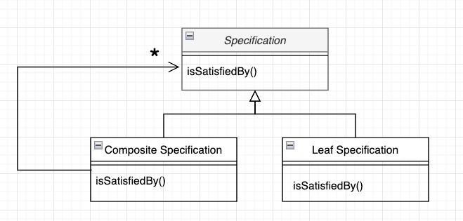

## intro

지난 글 [specification pattern (1) 개념과 구현](https://www.myanglog.com/specification%20pattern%20(1)%20%EA%B0%9C%EB%85%90%EA%B3%BC%20%EA%B5%AC%ED%98%84) 에 이어서 구체적인 여러 예시들을 통해 어떤 상황에서 이 패턴을 활용하기 좋은지 살펴보려고 한다. 그리고 패턴을 코드에 적용해보려고 할 때의 여러가지 구현방법들에 대해서도 소개할 예정이다. 

## specification이 필요한 케이스들

### 1. 검증(validation)

객체가 어떤 요건을 충족시키거나 특정 목적으로 사용할 수 있는지 가늠하고자 객체를 검증할 때.

예시>

- 청구서 발송 application: 청구서가 체납되었을 경우 → 붉은색으로 표시한다
- 예약 application: 상품이 제한 수량을 초과 or 현재시각이 오후2시 이전일 때 →  예약하기 버튼을 disable한다

### 2. 선택 (selection)

특정한 조건을 만족하는 컬렉션 내의 객체를 선택할 때.

예시> 

- 청구서 발송 application: 청구서 목록들 중 체납된 송장들만 선택한다.
- 예약 application: 프로모션 목록에 노출시킬 목적으로, 예약 가능한 기간 내의 이벤트 중인 상품들만 선택한다.

### 3. 생성(construction to order)

특정한 요구사항을 만족하는 새로운 객체의 생성을 명시할 때. 아직 존재하지 않는 객체에 대해 명시적으로 생성 규칙을 설정하여 새로운 객체를 만들어내거나 재구성하는 경우.

예시>

- 화물 배송 application: 상하이 → 베이징 여러 경로들을 사용해서 육류 화물을 운송하는 일정을 만들어낸다.
- 화학창고 포장(packing) application: 폭발성 화학물질 등 조건을 만족하는 화학물질을 담을 수 있는 포장기를 만들어낸다.

⇒ 위 세가지 케이스들은 엄밀하게 구분되지 않기도 한다. 비즈니스 요구사항에 따라 검증을 위해 만들어놓은 specification을 다른 기능을 위해 생성 용도로 활용할 수도 있다. 개념적으로 도메인에 대한 규칙이란 점에선 동일하기 때문이다. 그러나 specification을 사용하지 않는다면 동일한 규칙임에도 불구하고 각기 다른 구현 방식으로 표현하게 될 수도 있다. 

## 구현: 패턴을 활용할 곳을 찾았다면

내 코드에 써먹어보자- 라고 마음먹었다면 단계적으로 비용이 적게 드는 구현부터 시작해볼 수 있다. 명백하게 자주 사용될 경우라면 처음부터 풀 스펙을 다 구현해놓고 적용을 할수도 있지만, 요구사항 구현으로 바쁜 상황에서 쉽지 않을 수 있으니.. 😇

### **1. Predicate를 사용하기**

java의 경우 Specification interface와 유사한 Predicate라는 함수형 인터페이스를 사용해서 비슷하게 구현이 가능하다. 

Predicate 인터페이스 기본 메서드: 

- `boolean test(T t)`

→ `isSatisfiedBy`  대신 쓸 수 있다.

- `default Predicate<T> and(Predicate<? super T> other)`
- `default Predicate<T> or(Predicate<? super T> other)`
- `default Predicate<T> negate()`

→ composite로 specification 구현할 때 사용되는 함수들이 기본메서드로 구현되어 있어 쉽게 활용하기 좋다. 

예시>>

```java
Predicate<Customer> isSenior = customer -> customer.getAge() >= 60;
Predicate<Customer> isVip = Customer::isVip;
Predicate<Customer> isSeniorOrVip = isSenior.or(isVip);

/* client 코드 */
if (isSeniorOrVip.test(customer1)) {
	// 조건을 만족할 때 실행할 로직
}
```

그럼 Specification을 구현하지 않고 그냥 이 Predicate를 쓰면 될일 아닌가? 라는 생각이 들 수 있지만 두가지 단점이 있다. 

- Predicate는 범용적으로 사용되는 인터페이스라서 도메인 객체의 규칙이라는 것을 표현하기 어렵다.
- Predicate에 구현된 메서드로만 술어를 결합할 수 있고, 확장이 어렵다.

### **2. 하드코딩으로 Specification만들기**

specification 인터페이스를 구현하면서 할 수 있는 가장 쉬운 방법은 필요한 스펙만 하드코딩하는 것이다. 

```java
interface StorageSpecification {
	boolean isSatisfiedBy(Container aContainer);
}
```

식품 보관창고에 대한 검증을 해야하는 예시:

- 조건: `고기는 -4도 이하의 식품위생용 컨테이너에 보관한다`

```java
public class MeatStorageSpecification implements StorageSpecification {
    @Override
    public boolean isSatisfiedBy(Container aContainer) {
        return aContainer.canMaintainTemperatureBelow(-4) && aContainer.isSanitaryForFood();
    }
}
```

⇒ 장점: 쉽고 적은 비용

⇒ 단점: 변경에 취약하다

### **3. 파라미터를 넣어서 Specification 만들기**

하드코딩은 사실 좀 너무했다… Specification 클래스에 파라미터를 추가해보자. 

- 조건: `고기는 -4도 이하의 식품위생용 컨테이너에 보관한다`
- Specification클래스는 파라미터를 넣고 좀더 general한 이름으로 바뀌었다.

```java
public class CargoStorageSpecification implements StorageSpecification {
    private final int maxTemp;
    private final boolean isSanitaryForFood;

    public CargoStorageSpecification(int maxTemp, boolean isSanitaryForFood) {
        this.maxTemp = maxTemp;
        this.isSanitaryForFood = isSanitaryForFood;
    }

    @Override
    public boolean isSatisfiedBy(Container aContainer) {
        boolean tempCheck = aContainer.canMaintainTemperatureBelow(maxTemp);
        boolean sanitationCheck = isSanitaryForFood ? aContainer.isSanitaryForFood() : true;
        return tempCheck && sanitationCheck;
    }
}

/* specification 생성 코드 */
StorageSpecification meatStorage = new CargoStorageSpecification(4, true);
```

- ⇒ 장점: 하드코딩에 비해 좀더 유연하게 조건들을 설정할 수 있게 되었다.
- ⇒ 단점: 다른 파라미터가 필요해지면 또 변경해야한다. 파라미터 추가에 따라 복잡해진다.

### **4. Composite Specification**

지난 글에서 소개했던 방식이다. 각각의 조건/제약사항마다 specification클래스를 만들고, 디자인 패턴 중 composite pattern을 활용하여 결합한다. 

#

  

.


```java
/** 하나의 조건마다 Leaf Specification 클래스를 만든다 **/ 
public class MaximumTemperatureSpecification implements Specification<Container> {
    private final int maxTemp;

    public MaximumTemperatureSpecification(int maxTemp) {
        this.maxTemp = maxTemp;
    }

    @Override
    public boolean isSatisfiedBy(Container container) {
        return container.canMaintainTemperatureBelow(maxTemp);
    }
}

public class SanitaryForFoodSpecification implements Specification<Container> {

    @Override
    public boolean isSatisfiedBy(Container container) {
        return container.isSanitaryForFood();
    }
}

/** Composite Specification은 leaf를 가지고 있다. **/
public class CompositeSpecification<T> implements Specification<T> {
    private final List<Specification<T>> components = new ArrayList<>();

    public CompositeSpecification<T> with(Specification<T> specification) {
        components.add(specification);
        return this;
    }

    @Override
    public boolean isSatisfiedBy(T candidate) {
        for (Specification<T> each : components) {
            if (!each.isSatisfiedBy(candidate)) {
                return false;
            }
        }
        return true; // 모든 조건을 만족하면 true 반환
    }
}
```

위 예시는 모든 조건이 다 만족해야 `isSatisfiedBy`가 true를 반환한다. 

더 유연하게, 조건이 한개만 만족해도 true를 반환하는 등 다른 **논리연산자**들을 통해 specification을 결합할 수도 있다. 

```java
public abstract class Specification<T> {
    public abstract boolean isSatisfiedBy(T candidate);

    public Specification<T> and(Specification<T> other) {
		    // 모든 조건을 만족하면 true 반환
        return new ConjunctionSpecification<>(this, other);
    }

    public Specification<T> or(Specification<T> other) {
		    // 여기선 하나만 만족해도 true를 반환
        return new DisjunctionSpecification<>(this, other); 
    }
}
```

- ⇒ 장점: 매우 유연해졌다.
    - 이제 specification 하나하나는 좀더 일반적인 클래스가 되었다.
    - 논리 연산자를 활용해서 표현할 수 있다. (and, or, not 등 boolean끼리 결합할 수 있는 operation)
- ⇒ 단점: 복합적으로 specification을 만들고 엮는 비용이 발생한다.

## 마무리

핵심적으로 Specification은 어떤 객체를 선택할 것인지에 대한 선언과, 선택을 하는 객체를 분리하는 패턴이다. 이 **선언적이고 명시적인 정의** 가 필요하거나,  **객체에 대한 제약조건/요구사항으로 인해** 객체가 하는 역할이 잘 보이지 않게 될 수 있는 경우  활용하는게 좋을거라 생각된다. 

특히 composite specification을 활용하면 요구사항이 추가되었을 때 객체를 변경하는 것이 아니라, 새로운 specification을 추가하는 방식을 쓸 수 있다. 객체지향의 SRP(변경의 이유는 한가지여야한다)와  OCP(확장에 열려있고 수정에는 닫혀야한다) 원칙과도 연관이 된다. 구현에 활용해보려한다면 당장 필요한 요구사항에서부터 출발해서 점진적으로 확장해볼 수 있다. 

## 참고

- [마틴 파울러, Specification](https://www.martinfowler.com/apsupp/spec.pdf)
- [에릭 에반스, '도메인 주도 설계'](https://product.kyobobook.co.kr/detail/S000001514402)

