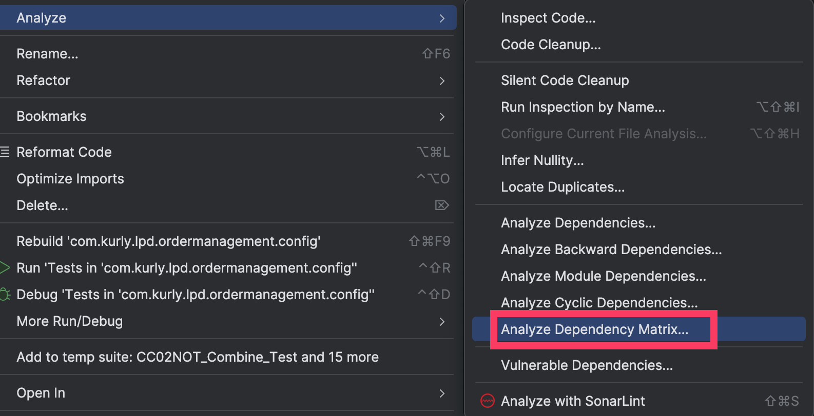

지난 1년 반동안 회사에서 레거시 시스템을 조금씩 개선하고 있다. 비즈니스 로직이 담긴 쿼리, 랜덤한 알파벳처럼 보이는 수십개의 컬럼으로 구성된 테이블들, 어디서부터 건드려야 고칠 수 있는지 한참을 들여다봐야 수정할 수 있는 복잡한 코드들.. 내가 이해한게 맞나 싶어서 팀원들에게 확인해야하기도 하고, 코드 수정에 늘 확신이 없었다.

고치고싶은 포인트들을 쉽게 건드릴 수 없는 이유들 중 하나는 ‘의존’ 문제였다. B를 수정하고 싶은데 A,C,D.. 여러군데에서 B를 사용하고 있으면 B를 수정하는 건 쉽지 않은 일이 된다. 아키텍처를 개선하는 과정에서 이 의존의 문제를 분석하는 데에 도움이 되었던 도구와 팀이 공유하는 규칙으로 만들기 위해 사용했던 도구들에 대해 간략히 정리해두려고 한다. (일부 이렇게 개선했지만, 여전히 진행중)

## 모듈/패키지 간의 의존관계 - 아키텍처 원칙

우리 팀은 처음부터 엄격하고 세부적인 아키텍처 원칙을 세워놓진 않았다. 대개 짧은 단위로 리팩토링하면서 점진적으로 개선해갔다. 

가장 중요한 것은 클린 아키텍처 책의 용어들을 빌리자면, 정책과 세부사항을 분리시키는 것이었다. 비즈니스적인 규칙, 정책 등 지속적으로 개념을 발전시켜야하는 부분은 잘 변하지 않고, 핵심적인 사항들이 된다. 세부사항은 기술적인 결정에 따라서 쉽게 변할 수 있는 db, api, framework.. 같은 것들이다. 

레거시 시스템에서는 정책과 밀접한 클래스가 세부사항에 의존하거나 강하게 결합되어있어서 세부사항을 바꾸려는 기술적인 결정이 너무 많은 코드들을 수정하게 만들었다. 중요한 비즈니스적 규칙이 구분되어 드러나있지 않고 단순 데이터와 다름없이 취급되고 있어서 이 부분들을 파악하고 분리하는 리팩토링을 하고, 우리의 의도대로 repackage하면서 정리하는 작업이 필요했다.

## DSM: 모듈/패키지 간의 의존관계 파악하기

모듈이나 패키지 간의 의존 관계를 파악할 때는 intellij의 DSM(Dependency Structure Matrix) 을 활용했다.

모듈, 패키지간의 의존성을 행렬 형태로 표현해주고, 서로 의존의 관계가 어떻게 되는지, 몇개의 클래스가 의존하고 있는지 등을 표현해준다.

- 실행방법
    - intellij의 action창 (shift+command+A) → Analyze Dependency Matrix… 선택
    - OR
    - intellij에서 분석하려는 모듈/패키지 등 우클릭 > analyze > Analyze Dependency Matrix… 선택
    
    
    

(예시 - DSM 돌린 것 캡처)


- 읽는 방법
    - 복잡해보이지만 위 예시에서 범례를 따라 읽어보면
        - 초록색 패키지는 선택된 연한파랑색 패키지를 사용한다. (controller —[uses]→ service)
        - 연한 파랑색 패키지는 노랑색 패키지들을 사용한다 (service —[uses]—> repository, config, supports, dto)
        - service 내의 in 패키지와는 순환참조 관계. (갈색 표시 또는 우하향 사선의 위쪽에 표시된 숫자가 있으면 그것이 순환참조..)
    - 특정 패키지에 대해서는 읽을 때 열(column)별로 읽으면 편하다. service가 의존하는 패키지 내의 수를 확인 할 수 있다. 클릭하면 더 자세하게 펼쳐져서 나온다.
    - 처음에 보면 거대한 n x n 행렬에 압도되어서 읽기가 어려워보이긴 하는데... 이해가 안된다면 유투브 영상을 참조하면 좀더 친절하게 설명해준다.  https://www.youtube.com/watch?v=moi49_V_4g0

## Archunit: 팀(나포함)이 규칙을 지키게 하기

아키텍처에 대해  ‘우리 이렇게 합시다~’ 라고 팀에서 합의는 할 수 있지만 개발을 하다보면 쉽게 무너지기도 하는 것 같다. 실수로 의도하지 않은 패키지에 클래스를 넣더라도 운영환경에서 내가 짠 코드는 잘 돌아가기 때문이다. 

[Archunit](https://www.archunit.org/) 은 시스템적으로 팀 전체가 일관되게 설계 원칙을 따를 수 있게 해준다. 

ArchUnit은 자바 코드 기반으로 아키텍처 규칙을 정의하고 검증할 수 있게 해주는 라이브러리다. 라이브러리 의존성을 추가하면 작성하던 Junit 테스트코드에 “*어플리케이션이 아키텍처 규칙을 준수하는지*"에 대한 테스트도 추가할 수 있게 된다. 기존에 단위/통합테스트를 통과하지 못하면 git push가 안된다거나, main 브랜치에 merge가 안되는 등의 CI(Continuous Integration) pipeline이 있다면 Archunit 테스트를 추가해서 아키텍처 규칙이 실패한 코드는 통합되지 못하도록 제한하는 것이 가능해진다. 

### 구현해본 Archunit 규칙들 예시

예시를 보면 빠르게 이해할 수 있다. 라이브러리의 문법?dsl?이 자연스러운 영어문장을 구성하는 것처럼 쓸 수 있기 때문이다.

1. dao에 대한 rule 추가
    - ‘dao’ 패키지 안에 있는 클래스들은  ‘service’와 ‘dao’패키지에 있는 클래스들만 접근 할 수 있도록 제한한다.  (service, dao → dao)
    - ⇒

```markdown
@ArchTest
    @SuppressWarnings("unused")
    public static final ArchRule daoRule = classes()
            .that().resideInAPackage("..dao..")
            .should().onlyBeAccessed().byAnyPackage("..services..", "..dao..", "..legacy..");
```

1. controller에 대한 rule 추가
    - ‘controller’ 패키지 안에 있는 클래스들은 ‘usecases’패키지 또는 ‘controller’ 패키지에 있는 클래스들만 접근해야한다. (controller → usecases, controller)
    - ⇒
    
    ```markdown
    
        @ArchTest
        @SuppressWarnings("unused")
        public static final ArchRule controllerRule = classes()
                .that().resideInAPackage("..controllers..")
                .should().accessClassesThat().resideInAPackage("..usecases..")
                .orShould().accessClassesThat().resideInAPackage("..controllers..");
    ```
    

### 그 외 쓰임새

글을 쓰면서 살펴보니 코드 컨벤션을 강제하는 데에도 쓸 수 있음.. 예제 코드 저장소들 보면서 조금씩 해보면 좋을 것들 시도해봐야겠다. 

https://github.com/TNG/ArchUnit-Examples/tree/main/example-junit5/src/test/java/com/tngtech/archunit/exampletest/junit5 

archunit 테스트에 한번 추가를 해두면 팀원들 모두가 강제로 따르게 하는 규칙이 되어서, 처음부터 여러 규칙을 엄격하게 적용하는 건 어렵고 가장 중요한 규칙부터 시작해서 점진적으로 협의의 수준에 따라 늘려가는게 좋은 것 같다. 

legacy에 대해 패키지를 정리하는 과정에서도, 한번에 전체 코드들을 다 아키텍처 규칙에 맞춘 패키지들로 이사를 시키긴 어려웠다. 어떤 시점에선 일부는 이사하고 일부는 그대로 남아있었다. 정리되지 않은 코드들은 따로 모아두고 archunit에서도 일단은 예외로 두기도 했다. 리팩토링, 리패키지만 완벽하게 하기에는 시간이 없으니까. 그렇다고 아무것도 하지 않는 것보다 한단계 진척시키고, 진행한 데까지 팀에 공유하고 test로 남겨두는 것은 의미있는 일이었다. 

## 참고

- https://www.jetbrains.com/help/idea/dsm-analysis.html
- https://www.youtube.com/watch?v=moi49_V_4g0
- https://www.archunit.org

